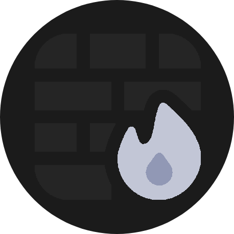
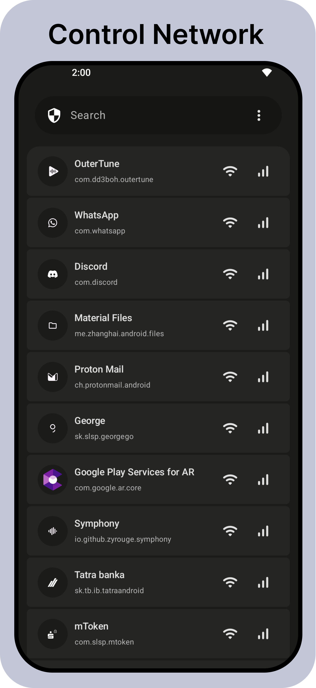
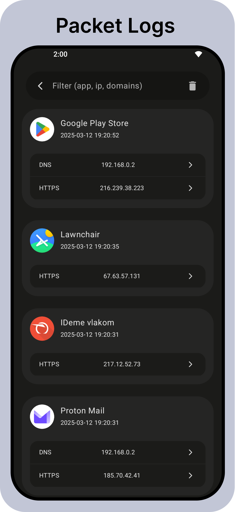
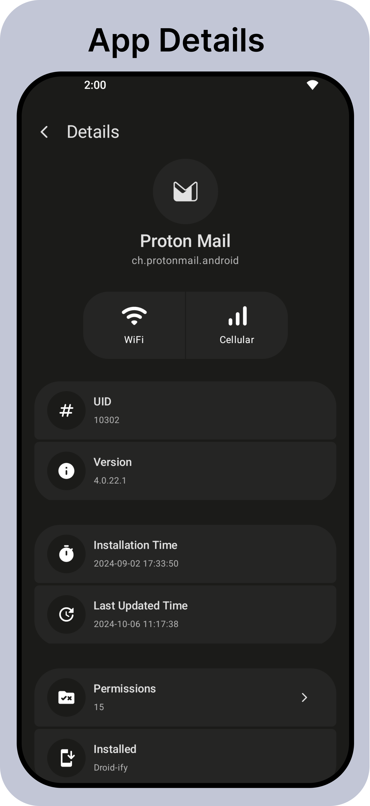

  

# Athena 
Root/VPN Support • Material3 • Minimalism

--- 

&nbsp;

    
    
    

&nbsp;

## About
Athena gives you complete control over your network activity. You can block malicious websites, filter content by categories (Gambling, Social Media, etc.), disable cellular/Wi-Fi access for specific apps, monitor data packets, and even block specific IPs or types of traffic. All of this works system-wide, including system apps.

&nbsp;

## Download

 &nbsp;

&nbsp;

## Features

-  📝 Root/VPN Mode 
-  🌟 Material3, Minimalistic Design
- 🔒 DNS Blocklist (categories,custom)
- 🚀 Logs 
- 🔐 Notify on install

&nbsp;

## Contact Me

-  Email : contact@easyapps.me
-  Discord : [Easy Apps](https://discord.gg/ZrP4G8z23H)

&nbsp;

## Checksums

-  MD5: `0d09d0bda26d7d25d9e7365178c6de73`
-  SHA1: `81b71e9a4eaff9596be35c0aae3294beff2ad9f2`
-  SHA-256: `63efc5b0c015d4855da4a593dacd29ffe63279c0b98d0f80e649103d429414ec`

&nbsp;

## License
    Athena

    Copyright (c)2024 vexzure (vexzure@proton.me)
    
    This program is free software: you can redistribute it and/or modify
    it under the terms of the GNU General Public License as published by
    the Free Software Foundation, either version 3 of the License, or
    (at your option) any later version.
    
    This program is distributed in the hope that it will be useful,
    but WITHOUT ANY WARRANTY; without even the implied warranty of
    MERCHANTABILITY or FITNESS FOR A PARTICULAR PURPOSE. See the
    GNU General Public License for more details.
    
    The above copyright notice, this permission notice, and its license shall be included in all copies or substantial portions of the Software.
    
    You can find a copy of the GNU General Public License v3 https://www.gnu.org/licenses/

